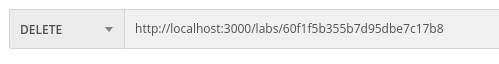

# API para manutenção de laboratórios e exames.

## Requisitos para utilização.

- MongoDB.
- Postman ou insomnia

## Observações

Os métodos de entrada e saída foram desenvolvidos para JSON.

## Instruções para utilização.

1 - Clone o repositório

- ```git clone git@github.com:dougfer/lab-exam-manager.git```

- entre na pasta do repositório que você acabou de clonar
  - ```cd dougfer/lab-exam-manager.git```

2 - Instale as dependências, crie uma váriável de ambiente através de um arquivo .env e inicie o servidor.

- ```npm install ```

 - Crie um arquivo .env com uma variável PORT e o valor de sua escolha.
Caso nenhuma porta seja declarada, será aberto como default na porta :3000.

-- ```npm start``` para iniciar o servidor.

## Utilização.

### Laboratório - /labs: 

POST:

É possível adicionar um ou mais de acordo com a necessidade, respeitando o padrão JSON e os atributos obrigatórios.


Com o seguinte resultado esperado: 


-------------------------------------------------------------------------------------------------------------------

GET:

É possível consultar todos os laboratórios cadastrados. Assim como também é possível consultar por id, contanto que passe o ID correspondente como parâmetro da URL.

Todos:


Por ID:


-------------------------------------------------------------------------------------------------------------------

PUT:

É possível editar por ID (passado por parâmetro na URL), somente o atributo que julgar necessário. Ex: Para editar o atributo status, passar somente ele.


Com o seguinte resultado:


---------------------------------------------------------------------------------------------------------------------

DELETE:

É possível deletar um laboratório passando o ID como parâmetro na URL.




----------------------------------------------------------------------------------------------------------------------

### Exames - /exames: 

POST:

É possível adicionar um ou mais de acordo com a necessidade, respeitando o padrão JSON e os atributos obrigatórios.


com o resultado esperado


----------------------------------------------------------------------------------------------------------------------

GET:

É possível consultar todos os exames cadastrados. Assim como também é possível consultar por id, contanto que passe o ID correspondente como parâmetro da URL.

Todos:


Por ID:


Também é possível consultar por nome do exame e receber os laboratórios vinculados a esse exame, basta seguir o padrão de query ```/exames/search?q=nome_do_exame```


----------------------------------------------------------------------------------------------------------------------

PUT:

É possível editar por ID (passado por parâmetro na URL), somente o atributo que julgar necessário. Ex: Para editar o atributo status, passar somente ele.


Com o seguinte resultado:


----------------------------------------------------------------------------------------------------------------------

DELETE:

É possível deletar um exame passando o ID como parâmetro na URL.


